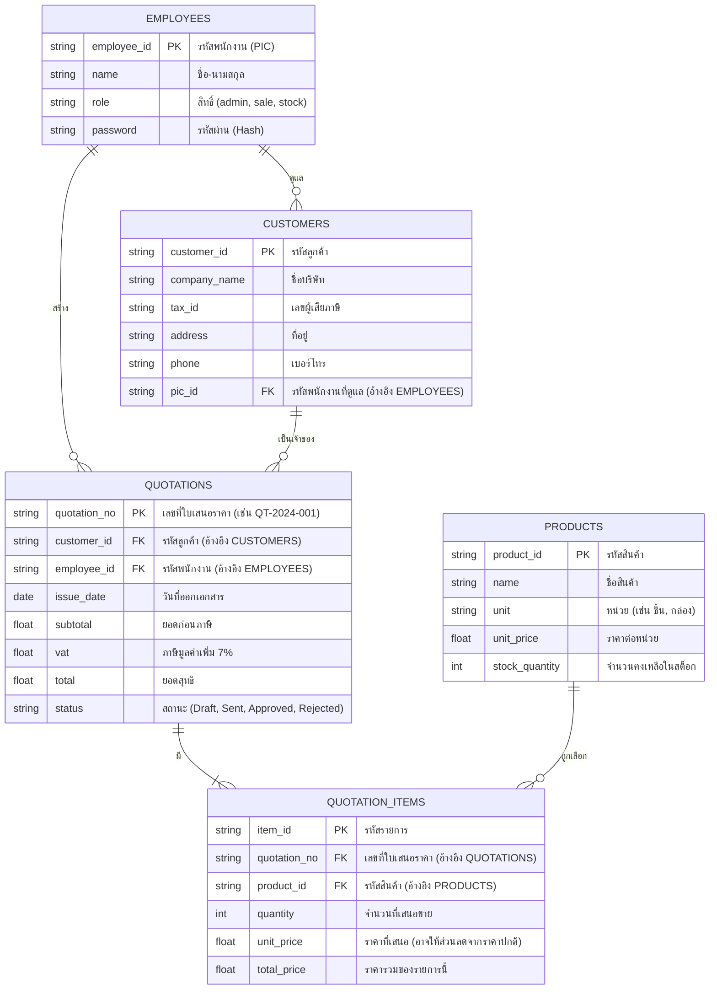

# Smart Quotation & CRM Architecture
เอกสารนี้อธิบายสถาปัตยกรรมระบบและโครงสร้างฐานข้อมูลของแอปพลิเคชันจัดการใบเสนอราคาและสต็อกสินค้า

## 1. System Architecture (สถาปัตยกรรมระบบ)

ระบบนี้ใช้รูปแบบสถาปัตยกรรม **Serverless API + React Frontend** โดยมีองค์ประกอบดังนี้:

```mermaid
graph TD
    Client[React + Vite Frontend\n(UI, State, Context)]
    API[n8n Webhooks\n(API Gateway & Logic)]
    DB[(Google Sheets / Database\nMaster Data)]
    AI[AI Provider\n(OpenAI/Gemini)]

    Client <-->|HTTP GET/POST| API
    API <-->|Read/Write| DB
    API <-->|Prompt/Response| AI
```

*   **Frontend (Client):** จัดการ UI และตรวจสอบสิทธิ์แบบเบื้องต้น (ย้ายการจัดการ State มาไว้ที่ `DataContext` เพื่อลดการยิง API ซ้ำซ้อน)
*   **Backend (API):** ใช้ n8n รับ Webhook ทำหน้าที่เสมือน Backend เพื่อส่งต่อข้อมูลไปยัง Database และ AI
*   **Database:** เก็บข้อมูล Master Data ทั้งหมด (ปัจจุบันใช้ Google Sheets เป็น Database หลัก)

---

## 2. Database Schema (โครงสร้างฐานข้อมูล)

เพื่อให้ระบบขยายสเกลได้และข้อมูลไม่ซ้ำซ้อน ฐานข้อมูลควรถูกแบ่งออกเป็น 5 ตารางหลัก (Normalization) ดังนี้:

### Entity Relationship Diagram (ERD)



---

## 3. Development Phases (แผนการพัฒนา)

### Phase 1: Foundation & Security (สถานะ: กำลังปรับปรุง)
- [x] สร้าง UI หน้าจอพื้นฐาน (React)
- [x] เชื่อมต่อ n8n เบื้องต้น
- [x] **Refactoring (เพิ่งทำ):** จัดการ Global State ด้วย `DataContext` เพื่อลด API Request (แก้ไขปัญหา N+1 Query)
- [ ] **Pending:** ปรับปรุงระบบ Authentication ให้ปลอดภัย โดยให้ n8n เป็นคน Validate ข้อมูล ไม่ใช่เช็คที่ฝั่ง Client

### Phase 2: Master Data Management (CRUD)
- [ ] พัฒนาระบบเพิ่ม/ลบ/แก้ไข (Database Manager) ให้รองรับโครงสร้างตาราง Customers และ Products
- [ ] จัดการระบบ Stock Manager ให้อัปเดตข้อมูล `stock_quantity` ได้จริง

### Phase 3: Transaction & Logic
- [ ] ปรับปรุงหน้า `QuotationMaker` ให้เวลาบันทึก (Save) มีการบันทึกลง 2 ตาราง คือ `QUOTATIONS` (หัวบิล) และ `QUOTATION_ITEMS` (หางบิล)
- [ ] เมื่อใบเสนอราคาถูกเปลี่ยนสถานะเป็น Approved ให้ทำการหักยอด `stock_quantity` อัตโนมัติ

### Phase 4: Analytics
- [ ] สร้าง Dashboard ดึงข้อมูลจาก `QUOTATIONS` เพื่อสรุปยอดขายรายเดือน
