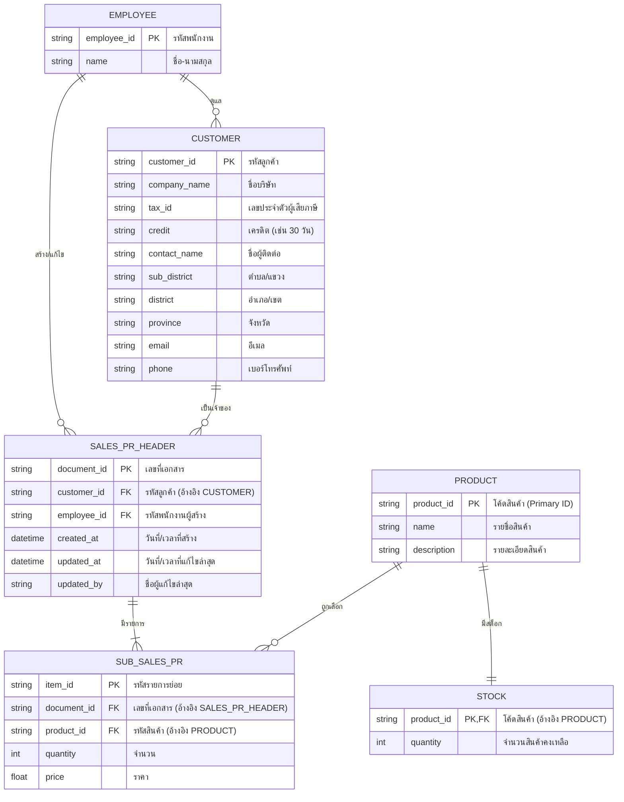

# Smart Quotation & CRM Architecture
เอกสารนี้อธิบายสถาปัตยกรรมระบบและโครงสร้างฐานข้อมูลของแอปพลิเคชันจัดการใบเสนอราคาและสต็อกสินค้า

## 1. System Architecture (สถาปัตยกรรมระบบ)

ระบบนี้ใช้รูปแบบสถาปัตยกรรม **Serverless API + React Frontend** โดยมีองค์ประกอบดังนี้:

```mermaid
graph TD
    Client[React + Vite Frontend\n(UI, State, Context)]
    API[n8n Webhooks\n(API Gateway & Logic)]
    DB[(Google Sheets / Database\nMaster Data)]
    AI[AI Provider\n(OpenAI/Gemini)]

    Client <-->|HTTP GET/POST| API
    API <-->|Read/Write| DB
    API <-->|Prompt/Response| AI
```

*   **Frontend (Client):** จัดการ UI และตรวจสอบสิทธิ์แบบเบื้องต้น (ย้ายการจัดการ State มาไว้ที่ `DataContext` เพื่อลดการยิง API ซ้ำซ้อน)
*   **Backend (API):** ใช้ n8n รับ Webhook ทำหน้าที่เสมือน Backend เพื่อส่งต่อข้อมูลไปยัง Database และ AI
*   **Database:** เก็บข้อมูล Master Data ทั้งหมด (ปัจจุบันใช้ Google Sheets เป็น Database หลัก)

---

## 2. Database Schema (โครงสร้างฐานข้อมูล)

เพื่อให้ระบบขยายสเกลได้และข้อมูลไม่ซ้ำซ้อน ฐานข้อมูลควรถูกแบ่งออกเป็น 5 ตารางหลัก (Normalization) ดังนี้:

### Entity Relationship Diagram (ERD)



---

## 3. Development Phases (แผนการพัฒนา)

### Phase 1: Database Setup & AI Customer Extraction
- [ ] **ปรับโครงสร้างฐานข้อมูล (Database):** เตรียมถังข้อมูลทั้ง 6 ถัง (Customer, Product, Stock, Employee, Sales PR, Sub Sales PR) ให้ตรงตามโครงสร้างใหม่
- [ ] **AI Customer Parsing:** สร้างฟังก์ชัน + หน้า UI สำหรับกรอกข้อมูลลูกค้า โดยมีปุ่มให้ AI อ่านข้อความดิบแล้วจัดเรียงลงฟิลด์ต่างๆ (ชื่อ, ภาษี, ตำบล, อำเภอ, จังหวัด ฯลฯ) ให้อัตโนมัติ
- [ ] **Authentication:** ทำระบบ Login อย่างง่ายแบบ Single Role (ทีมขาย) และเก็บข้อมูล User สำหรับใช้ใน Timestamp

### Phase 2: Master Data Management (Product & Stock)
- [ ] **Product & Stock Manager:** ทำระบบ CRUD สำหรับเพิ่มสินค้าและจัดการสต็อก โดยแยกระหว่างตาราง Product และ Stock ตามข้อกำหนด

### Phase 3: Sales PR (Quotation) Core System
- [ ] **สร้าง Sales PR:** ปรับปรุงหน้า `QuotationMaker` ให้รองรับการบันทึกข้อมูลแบบ 1-to-Many แยกลง `SALES_PR_HEADER` และ `SUB_SALES_PR`
- [ ] **ระบบ Audit Trail:** ทุกครั้งที่มีการสร้างหรือแก้ไขเอกสาร จะต้องมีการประทับเวลา `created_at`, `updated_at`, และบันทึกชื่อผู้แก้ไข `updated_by`
- [ ] **เชื่อมต่อสต็อก:** ระบบสามารถอัปเดต/ตัดสต็อกผ่านตาราง `STOCK` โดยอ้างอิงรหัสสินค้าจากตารางย่อย
