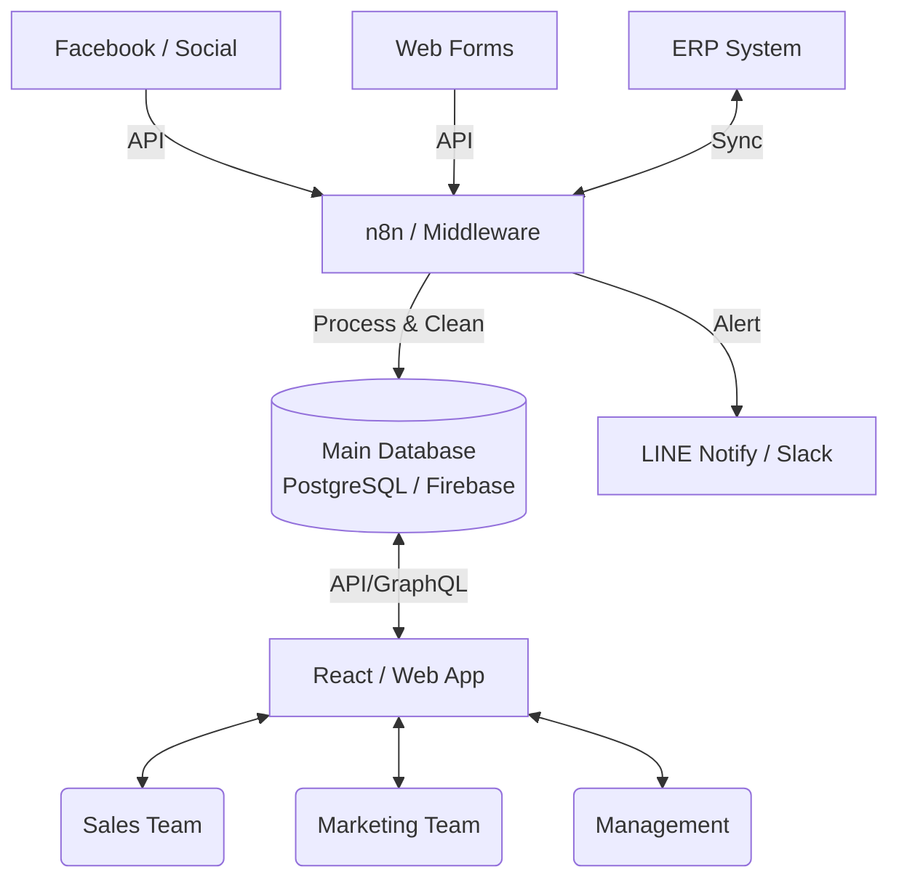
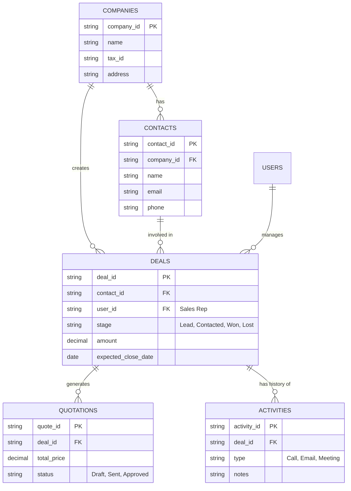

# โครงสร้างสถาปัตยกรรมระบบ CRM แบบเต็มรูปแบบ (Full-Scale CRM Architecture)

นี่คือโครงร่างมาตรฐานของระบบ CRM ระดับองค์กร (Enterprise Grade) ที่ออกแบบมาเพื่อรองรับธุรกิจที่มีความซับซ้อน ครอบคลุมตั้งแต่การหาลูกค้าใหม่ ไปจนถึงบริการหลังการขาย

---

## 1. องค์ประกอบหลักของระบบ (Core Modules)

ระบบ CRM ที่สมบูรณ์จะแบ่งออกเป็น 4 เสาหลัก ดังนี้:

### 💼 A. Sales Cloud (ระบบจัดการการขาย) - *ตัวที่เรากำลังทำอยู่*
*   **Lead Management:** จัดการรายชื่อผู้มุ่งหวังที่ได้มาจากช่องทางต่างๆ
*   **Sales Pipeline (Kanban):** กระดานติดตามสถานะดีล (เหมือนที่เราทำใน Prototype)
*   **Quotation & Invoicing:** ระบบสร้างใบเสนอราคาและใบแจ้งหนี้อัตโนมัติ
*   **Product & Price Book:** แค็ตตาล็อกสินค้าและระบบคำนวณราคาส่วนลด

### 🎯 B. Marketing Cloud (ระบบการตลาด)
*   **Campaign Management:** ระบบติดตามแคมเปญโฆษณา (เช่น Facebook Ads, Google Ads)
*   **Email Automation:** ระบบส่งอีเมลอัตโนมัติตามพฤติกรรมลูกค้า (เช่น ส่งอีเมลลดราคาเมื่อลูกค้าไม่ตอบกลับ 3 วัน)
*   **Lead Scoring:** ระบบให้คะแนนความสนใจของลูกค้า AI จะประเมินว่าลูกค้ารายไหนมีโอกาสซื้อสูงสุด

### 🎧 C. Service & Support Cloud (ระบบบริการหลังการขาย)
*   **Ticketing System:** ระบบแจ้งซ่อมหรือรับเรื่องร้องเรียน (Helpdesk)
*   **Knowledge Base:** ฐานข้อมูลช่วยเหลือตัวเองสำหรับลูกค้า
*   **SLA Tracking:** ระบบติดตามความเร็วในการตอบกลับและการแก้ปัญหาให้ลูกค้า

### 📊 D. Analytics & Dashboard (ระบบรายงาน)
*   **Sales Forecasting:** การพยากรณ์ยอดขายล่วงหน้า
*   **Performance Tracking:** รายงานผลงานของเซลส์แต่ละคน (KPIs)
*   **Custom Reports:** กราฟสรุปยอดขายที่ผู้บริหารสามารถดูได้แบบ Real-time

---

## 2. การไหลของข้อมูล (Data Flow & Integrations)

---

## 3. โครงสร้างความสัมพันธ์ฐานข้อมูล (ER-Diagram)

เพื่อให้ Pipeline ทำงานได้อัตโนมัติ ฐานข้อมูลจะต้องถูกออกแบบให้เชื่อมโยงกัน (Relational DB)

---

## 4. แผนการพัฒนาจาก Prototype สู่ระบบจริง (Scaling Plan)

หากนำโปรเจกต์นี้ไปพัฒนาต่อ นี่คือสิ่งที่จะต้องเปลี่ยนเพื่อยกระดับจาก Prototype เป็น Full System:

1.  **เปลี่ยน Database:** ย้ายจาก Google Sheets เป็น Database ของจริง เช่น **PostgreSQL** หรือ **Supabase** เพื่อรองรับข้อมูลหลักแสนบรรทัด และแก้ปัญหา Concurrency (การเซฟชนกัน)
2.  **เพิ่มระบบ Role-Based Access Control (RBAC):** 
    *   *เซลส์ระดับล่าง:* เห็นเฉพาะดีลและลูกค้าของตัวเอง
    *   *ผู้จัดการฝ่ายขาย:* เห็นดีลของลูกน้องทุกคนในทีม
    *   *ผู้บริหาร:* เห็น Dashboard ยอดรวมบริษัท
3.  **เพิ่ม Web Socket:** ทำให้เวลามีเซลส์คนนึงลากการ์ดเปลี่ยนสถานะ หน้าจอของหัวหน้าจะอัปเดตตามแบบ Real-time ทันทีโดยไม่ต้องกดรีเฟรช (เหมือน Google Docs)
4.  **เพิ่ม Audit Log:** บันทึกประวัติทุกอย่าง (เช่น เซลส์ A แอบลบข้อมูลลูกค้าเมื่อเวลา 14:00) เพื่อความปลอดภัยของข้อมูลบริษัท
